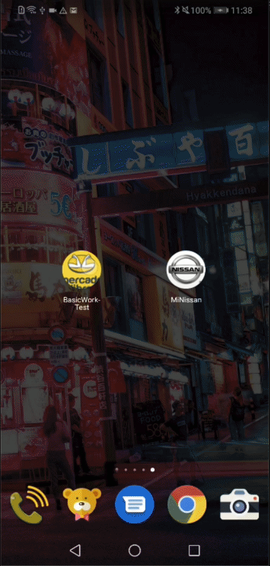

# MELI-Android

## walkthrough App

## Detalles técnicos

Proyecto implementado con arquitectura Mvvm Clean de 3 Layers.

  

Tecnologías relevantes utilizadas:

- Moshi
- Hilt
- Coroutines
- Flow
- LiveData
- Mockito
- Glide
- Toml versionamiento
- kotlinter

Patrones relevantes utilizados:

- Repository
- Singleton
- Abstract Factory
- Adapter
- Observer
- Chain of Responsability
- State
- Estrategy

El proyecto consta de dos vistas en la primera se realiza la búsqueda de un artículo, se consume un servicio y se muestra la lista de items, una vez el usuario hace clic en uno de los items, esta acción lo lleva a la siguiente pantalla descriptiva, en donde se consume otro servicio con el fin de obtener el detalle del item seleccionado, en esta pantalla se encuentra la galería de imagenes asociadas, un botón de compartir y el detalle del producto.

Se desarrolló un modelo de UI por estados para ambas vistas, un Observador de estado de red en caso de perder conexión se le informará al usuario inmediatamente yvalidaciones de servicio.

La intención es mostrar capacidades de arquitectura y desacoplamiento.

## TODO  Deseables

Usar únicamente Flow en lugar de LiveData
Agregar Paginación
Completar coverage de test
Splash Android 12
Implementar Room & Agregar la lógica de repository local

Se puede utilizar MVI con Compose pero no es tan común entonces decidí un approach más tradicional

## Autora
Denise Méndez